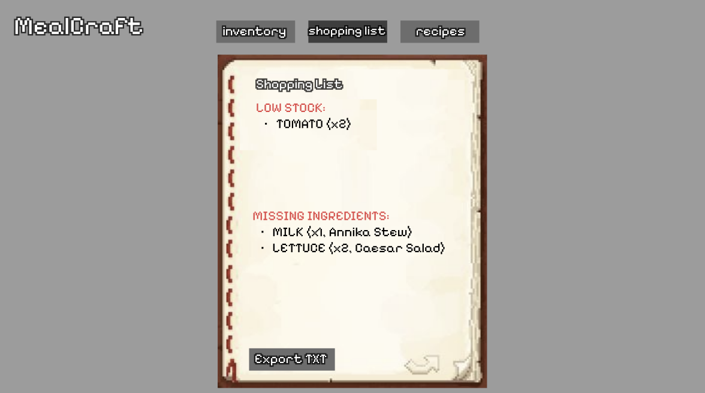
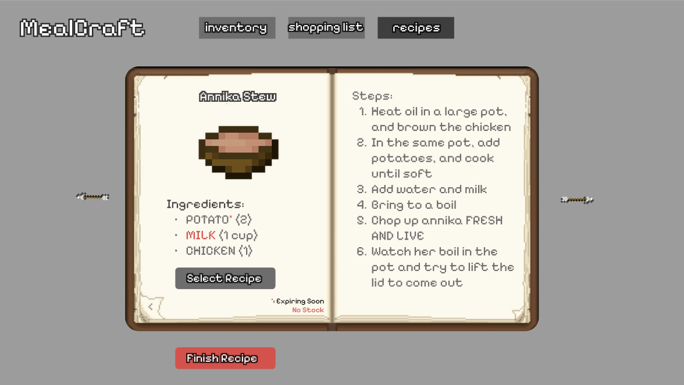

# MealCraft by MoJAAng

Teacher Name: Nasira Shahin
 Member Names: Annika Hambali, Jessie Luo, & Angela Zhong
 Member Contacts: annham008@gmail.com, jessieluo56@gmail.com, angelazhong12@gmail.com

## Table of Contents
1. Project Title and Description
2. Usage
3. Documentation
4. Functionality
5. Classes
6. Acknowledgements

## 1. Project Title and Description
MealCraft is an affordable, digital, smart grocery organizer that recreates the core functionalities of a smart refrigerator interface on the user’s computer. Users can manually enter food items with attributes such as category, quantity, and expiration date, which are stored in a central inventory list and displayed through a graphical overview of available ingredients. The system tracks expiration dates to generate a prioritized “use-soon” list for items that are close to going bad, helping reduce food waste, while also monitoring stock levels to remind users when the ingredients of their preference are low or out of stock and automatically produce a grocery list. Using the current inventory, the program can also recommend recipes that account for dietary restrictions and prioritize those that use ingredients nearing expiration, combining inventory management, reminders, and meal planning into a single practical and accessible tool.

Project Goals:
- Reduce food waste by identifying items that are nearing expiration and prioritizing them for use.
- Assist with meal planning by matching recipes to available ingredients and dietary restrictions.
- Automatically generate grocery lists by calculating only the ingredients missing from selected meals
- Display clear visual organization of inventory by category and expiration status for easy comprehension.
- Provide affordable and accessible technology by relying on user input instead of specialized hardware or sensors.

## 2. Usage

## 3. Documentation
Figma UI Concept Designs

## 4. Functionality

## 5. Classes
### Class Diagram

### Class Description & Pseudocode 
The MealCraft class design is built around five core structures: Fridge, FoodItem, Recipe, IngredientLine, and the Category enum. Each class has a specific purpose and interacts with other classes through UML relationships.

Fridge: The Fridge class acts as the central manager of the application. It stores the user’s inventory and recipes, supports fast item lookup, tracks expiration dates, and enables recipe-based cooking workflows.
Fields:
- inventoryByName: Map<String, FoodItem>
  - Maps each food item name to its FoodItem object for fast retrieval.
- expirationIndex: Map<LocalDate, List<FoodItem>>
  - Groups items by expiration date for expiration-based filtering.
- recipes: List<Recipe>
  - Stores all recipe options available to the user.
Methods:
- addFood(item: FoodItem): void
  - Adds a new food item into inventory and expiration tracking.
  - Pseudocode:
    - Normalize the item name.
      - Makes it all lowercase to reduce repetition.
    - Store the item in the inventory map.
    - Add the item to the list for its expiration date.
- removeFood(name: String, amount: double): boolean
  - Removes a given amount of an item from inventory if possible.
  - Pseudocode:
    - Check if the item exists in inventory.
    - Check if enough quantity is available.
    - Subtract the requested amount.
    - Remove the item if quantity becomes zero.
    - Return whether removal succeeded.
- updateQuantity(name: String, newAmount: double): void
  - Updates an item’s quantity in inventory.
  - Pseudocode:
    - Find the item by name.
    - Replace its quantity with the new value.
- addRecipe(r: Recipe): void
  - Stores a recipe in the fridge system.
  - Pseudocode:
    - Add the recipe to the recipe list.
- removeRecipe(r: Recipe): void
  - Removes a recipe from the stored recipe list.
  - Pseudocode:
    - Remove the recipe from the recipe list.
- getExpiringSoon(withinDays: int): List<FoodItem>
  - Returns items expiring within a given number of days.
  - Pseudocode: 
    - Get today’s date.
    - Create an empty list for results.
    - For each date within the given range.
      - If items exist for that date.
        - Add them to the result list.
    - Return the result list.
- getBestRecipe(): Recipe
  - Selects the best recipe option based on inventory availability.
  - Pseudocode:
    - For each stored recipe.
      - Check if it can be made with current inventory.
      - Prefer recipes with no missing ingredients and ingredients that will expire soon.
      - Return the selected recipe.
- cookRecipe(r: Recipe): Boolean
  - Checks feasibility and deducts ingredient amounts if the recipe can be made.
  - Pseudocode:
    - Check if the recipe can be made.
    - If not possible, return false.
    - Deduct ingredient quantities from inventory.
    - Return true.
- getInventory(): Collection<FoodItem>
  - Returns the fridge inventory collection.
  - Pseudocode: 
    - Return all food items in inventory.
UML Relationships:
- Composition with FoodItem
  - The fridge owns its inventory items.
- Aggregation with Recipe
  - Recipes are stored in the fridge but can exist independently.

#### FoodItem: The FoodItem class represents a single real inventory item stored in the fridge. It tracks quantity, unit, expiration date, category, and optional image metadata.

Fields:
- name: String
  - Display name of the item.
- normalizedName: String
  - Standardized name used for consistent map lookup.
- quantity: double
  - How much of the item is available.
- unit: String
  - Measurement unit.
- category: Category
  - Category label for sorting and filtering.
- expirationDate: LocalDate
  - Expiration date for spoilage tracking.
- imgFilePath: String
  - Optional path to an image file for UI display.

Methods:
- getName(): String
- getNormalizedName(): String
- getQuantity(): double
- getUnit(): String
- getCategory(): Category
- getExpirationDate(): LocalDate
- getImgFilePath(): String

UML Relationships:
- Association with Category
  - Each FoodItem is tagged with one category.
 
#### Recipe: The Recipe class represents a meal blueprint. It stores preparation steps and a list of ingredient requirements, then checks whether the fridge inventory can fulfill those requirements.

Fields: 
- name: String
  - Recipe title.
- steps: List<String>
  - Ordered cooking instructions.
- ingredients: List<IngredientLine>
  - Ingredient requirements needed to cook the recipe.
- imgFilePath: String
  - Optional image for recipe UI display.

Methods:
- getName(): String
  - Returns recipe name.
- printIngredients(): void
  - Displays formatted ingredient requirements.
  - Pseudocode:
    - Print each ingredient’s amount, unit, and name.
- printSteps(): void
  - Displays formatted cooking steps
  - Pseudocode:
    - Print each step in order.
- missingIngredients(fridge: Fridge): List<IngredientLine>
  - Returns ingredient lines that are missing or insufficient in inventory.
  - Pseudocode:
    - Create an empty list
    - For each ingredient requirement
     - Check if the fridge has enough of that item
      - Add to missing list if insufficient
    - Return missing list
- canMake(fridge: Fridge): boolean
  - Checks whether the fridge contains enough ingredients to cook the recipe.
  - Pseudocode:
    - Check whether missing ingredient list is empty.
    - Return true if empty, otherwise false.
      
UML Relationships:
- Composition with IngredientLine
  - Ingredient lines exist only as part of a recipe.

#### IngredientLine: The IngredientLine class represents one required ingredient entry in a recipe. Unlike FoodItem, it does not represent inventory ownership; it only represents what a recipe needs.

Fields:
- itemName: String
  - Name of the required ingredient.
- amount: double
  - Amount required.
- unit: String
  - Measurement unit required.

Methods:
- getItemName(): String
- getAmount(): double
- getUnit(): String

#### Category: The Category enum provides a standardized labeling system to classify and organize food items in the inventory.

Values:
- DAIRY_EGGS
- FRUITS_VEGETABLES
- PROTEINS
- OTHER

### Pseudocode

A. Main Application Setup Method
   1. Initialize Fridge fridge
   2. Initialize empty collections inside fridge
      i. inventoryByName map
      ii. itemsByExpirationDate map
      iii. recipes list
   3. Load starter data
      i. Add sample FoodItem objects to fridge
      ii. Add sample Recipe objects to fridge
   4. Display main menu, and begin program loop

B. Adding Food Item Method
   1. Prompt user for item name, quantity, unit, category, expiration date, and image path
   2. Normalize item name by converting to lowercase and trimming whitespace
   3. Create new FoodItem
   4. Call fridge.addFood(foodItem)
   5. If item exists already, increase existing quantity, and update expiration date by choosing earliest
   6. Otherwise, insert new item into inventoryByName
   7. Update itemsByExpirationDate bucket for expiration date

C. Removing Food Item Method
   1. Prompt user for item name and amount to remove
   2. Normalize item name by converting to lowercase and trimming whitespace
   3. Search for item using inventoryByName
   4. If item does not exist, print error message and return
   5. If amount is invalid, or amount exceeds quantity, print error message and return
   6. Subtract amount from FoodItem.quantity
   7. If updated quantity becomes 0, remove item from inventoryByName, and remove item from expiration bucket in itemsByExpirationDate

D. Viewing Inventory Method
   1. Retrieve collection of inventory items
   2. For each FoodItem in items, print name, quantity + unit, category, and expiration date

E. Viewing Expiring Soon Method
   1. Prompt user for number of days withinDays
   2. Compute date range
   3. Use itemsByExpirationDate to retrieve only relevant expiration buckets
   4. For each date bucket in the range, add all food items expiring on that date to result list
   5. Display result list to user

F. Adding Recipe Method
   1. Prompt user for recipe metadata, including recipe name and image path
   2. Initialize empty ingredients list
   3. While user still has ingredients to add, prompt for ingredient name, amount, and unit; create an IngredientLine, and add IngredientLine to recipe list
   4. Initialize empty steps list
   5. While user still has steps to add, prompt for step text, and add step to recipe step list
   6. Create Recipe
   7. Call fridge.addRecipe(recipe)

G. Missing Ingredients Method
   1. Prompt user to select a recipe
   2. Initialize empty missing list
   3. For each IngredientLine, normalize ingredient name, and look up matching FoodItem in inventoryByName
   4. If item is missing, add full IngredientLine to missing list
   5. Otherwise if quantity is insufficient, compute difference between required and available, and add IngredientLine with missing amount
   6. Display missing ingredient list

H. Can Make Recipe Method
   1. Prompt user to select a recipe
   2. For each IngredientLine, normalize ingredient name, look up matching FoodItem in inventoryByName
   3. If item is missing, or quantity is too low, return false
   4. Otherwise, return true

I. Cooking Recipe Method
   1. Prompt user to select a recipe
   2. If recipe.CanMake(fridge) is false, show missing ingredient list, and stop
   3. Otherwise, for each IngredientLine required, normalize ingredient name, retrieve FoodItem from fridge map, and subtract required amount from FoodItem quantity
   4. If quantity becomes 0, remove FoodItem from fridge inventory, and remove FoodItem from expiration index
   5. Print updated inventory

J. Best Recipe Recommendation Method
   1. Prompt user for expiring soon window withinDays
   2. Retrieve the list of expiring food items by calling fridge.getExpiringSoon(withinDays)
   3. Create a fast lookup group of expiring item names
   4. Initialize variables to track the best option
   5. For each recipe in the fridge recipe list, determine which ingredients are missing, determine whether the recipe can be made now, determine how many expiring items the recipe would use, and score the recipe
   6. If this recipe’s score is better than the current best score, update bestRecipe and bestScore
   7. Display final recommendation

### Data Structures Used:

- List<Recipe> recipes
  - Stores all recipes the user has saved in one expandable collection so the fridge can iterate through them to display or recommend meals
  - Used for: recipe storage, recipe recommendation, and meal selection
  - Why: adding recipes is O(1), and scanning recipes to find the best option is O(r)
- List<IngredientLine> ingredients
  - Stores the required ingredients for a recipe as structured objects (ingredient name, amount, unit), making recipe checks more consistent than raw strings
  - Used for: determining if a recipe can be made, computing missing ingredients, and deducting quantities when cooking
  - Why: iterating through ingredient requirements takes O(i), and each ingredient lookup is O(1) on average
- List<String> steps
  - Stores recipe instructions in an ordered list so that steps print in the correct cooking sequence
  - Used for: step-by-step recipe display
  - Why: printing or iterating instructions takes O(s)
- List<FoodItem> itemsByExpirationDate
  - Stores all food items that share the same expiration date together in a single collection tied to one date key
  - Used for: grouping items with the same expiration date
  - Why: adding items to a date bucket is O(1), and processing the bucket is O(m)
- Enum category
  - Defines a standardized set of labels for classifying food items
  - Used for: categorization and filtering of inventory items
  - Why: category checks and comparisons run in O(1) time
- Collection<FoodItem> getInventoryItems()
  - Returns the fridge’s inventory as a general Collection
  - Used for: iterating through inventory for printing and display
  - Why: returning a Collection allows iteration in O(n)

## 6. Acknowledgements
https://www.w3schools.com/java/java_enums.asp
 https://docs.oracle.com/javase/8/docs/api/java/util/Collections.html
 https://docs.oracle.com/javase/8/javase-clienttechnologies.html
